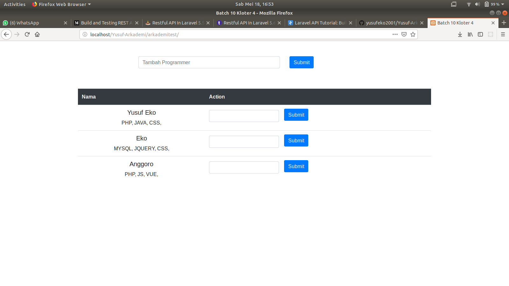

# Arkademy

## Jawaban Tes Arkademy

Jawaban No 1 - 5, bisa dijalankan melalui:
- Text Editor Online : [onlinegdb.com](https://www.onlinegdb.com/).

### No 1
- Buka code editor online: [onlinegdb.com](https://www.onlinegdb.com/).
- Copy paste kode tersebut ke onlinegdb.com.
- Maka hasilnya akan muncul berupa data json.

Note:
### REST API itu :
- Fungsi" yang dapat dipanggil dan menghasilkan JSON/XML
### Kegunaan JSON pada REST API : 
- digunakan untuk melakukan pertukaran data antara bahasa pemrograman.
- berinteraksi dengan aplikasi lain 
### No 2
- Buka code editor online: [onlinegdb.com](https://www.onlinegdb.com/).
- Copy paste kode tersebut ke onlinegdb.com.
- Maka hasilnya akan muncul berupa true atau false berdasarkan parameter yang diinput.

### No 3
- Buka code editor online: [onlinegdb.com](https://www.onlinegdb.com/).
- Copy paste kode tersebut ke onlinegdb.com
- Maka hasilnya akan muncul pola sesuai soal.

### No 4
- Buka code editor online: [onlinegdb.com](https://www.onlinegdb.com/).
- Copy paste kode tersebut ke onlinegdb.com.
- Maka hasilnya berupa array yang telah disorting.

### No 5
- Buka code editor online: [onlinegdb.com](https://www.onlinegdb.com/).
- Copy paste kode tersebut ke onlinegdb.com.
- Maka hasilnya berupa karakter acak sebanyak jumlah yang diinput di parameter.

### No 6 (arkademitest).
Untuk menjalankan aplikasi arkademitest, lakukan langkah berikut
- Aktifkan web server (apache) atau XAMPP.
- Import file sql di dalam folder arkademitest ke phpmyadmin.
- Pindahkan folder arkademites ke folder HTDOCS dari aplikasi XAMPP.
- Akses url berikut: localhost/arkademitest.
- Aplikasi sudah bisa digunakan.

Demo Aplikasi:

##### Credits
Thanks to Arkademy.

Regards, Yusuf Eko Anggoro.
